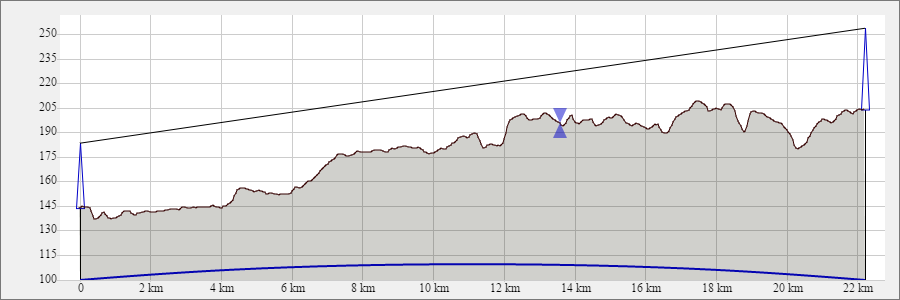

# ham_elevation
Useful earth elevation chart in javascript. No any external dependencies.  
To examine just run demo page.html in web browser.

Live example: http://22dx.ru/online/karta-vy-sot/ 

Developed by Alexander Sholohov  <ra9yer@yahoo.com>
